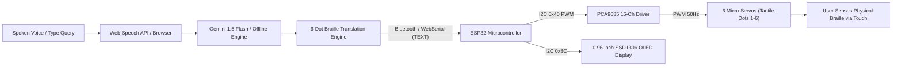
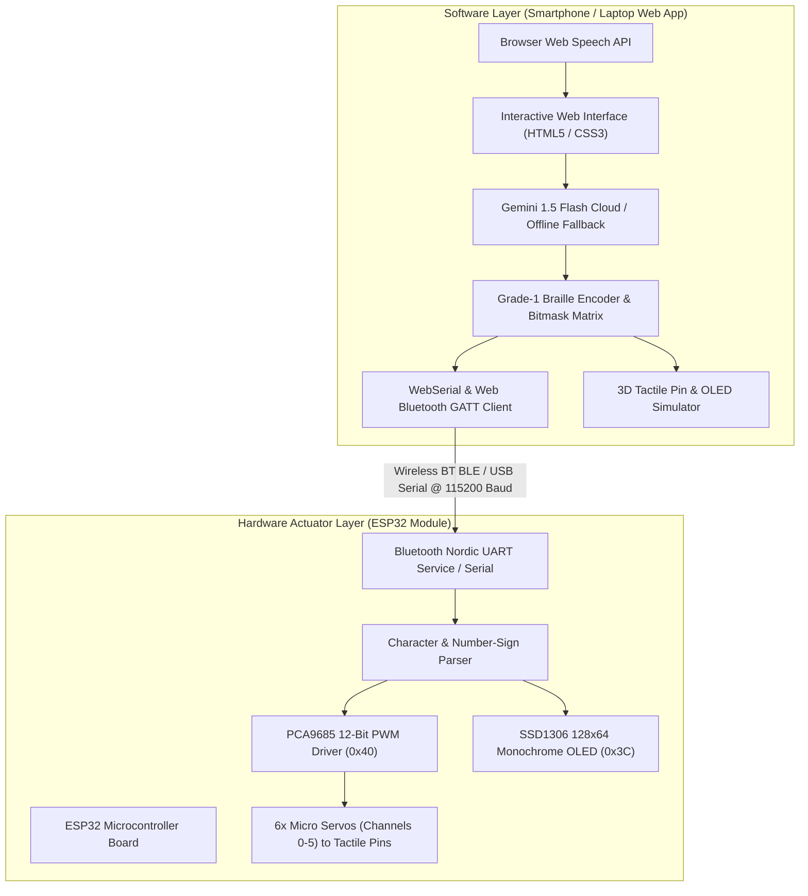

# 🌟 EchoBraille — Intelligent AI-Powered Voice-to-Braille Assistive System

> **Smart India Hackathon 2026 (SIH) — Team EchoBraille**  
> **Problem Statement ID:** SIH26215 | **Category:** Hardware / MedTech / HealthTech  
> *"Bridging conversational AI and the deafblind community through affordable, real-time, 6-dot tactile communication."*

---

## 📘 Master Specification Document
For the complete line-by-line code analysis, firmware architecture, circuit schematics, and protocol specification, refer to:  
👉 **[ECHOBRAILLE_MASTER_DOCUMENTATION.md](file:///c:/Users/HP/OneDrive/Desktop/Echobraille/docs/ECHOBRAILLE_MASTER_DOCUMENTATION.md)**

---

## 📑 Table of Contents
1. [Executive Summary](#-executive-summary)
2. [Problem Statement & Background](#-problem-statement--background)
3. [The EchoBraille Solution](#-the-echobraille-solution)
4. [End-to-End System Architecture](#-end-to-end-system-architecture)
5. [Hardware Design & Component Breakdown](#-hardware-design--component-breakdown)
6. [Pinout & Wiring Schematics](#-pinout--wiring-schematics)
7. [Firmware Architecture (`echobraille_bluetooth.ino`)](#-firmware-architecture-echobraille_bluetoothino)
8. [Web Application & Software Architecture](#-web-application--software-architecture)
9. [AI & Speech Integration (Latency Optimization)](#-ai--speech-integration-latency-optimization)
10. [Bill of Materials (BOM) & Cost Feasibility](#-bill-of-materials-bom--cost-feasibility)
11. [Step-by-Step Installation & User Guide](#-step-by-step-installation--user-guide)
12. [Future Scope & Development Roadmap](#-future-scope--development-roadmap)

---

## 📌 Executive Summary

**EchoBraille** is an intelligent, low-cost, voice-to-tactile assistive communication system designed for individuals who are deafblind or severely visually/auditorily impaired. 

Traditional artificial intelligence tools (voice assistants, chatbots, LLMs) communicate exclusively through visual text or auditory speech. For a deafblind user, these interfaces remain completely inaccessible. Furthermore, commercial refreshable Braille displays cost between **₹1,50,000 to ₹4,00,000 INR ($1,800 to $5,000 USD)**, putting independent digital access out of reach for over 95% of the population who need it.

EchoBraille changes this paradigm by combining:
1. A **hands-free Web Speech & Google Gemini 1.5 Flash AI app** that captures spoken queries and formulates concise answers.
2. An **intelligent Braille translation engine** that maps characters and numbers into standard 6-dot Braille bitmasks.
3. A **modular ESP32 hardware actuator (≈ ₹1,500 INR)** that drives 6 servo-controlled tactile pins via a PCA9685 driver, physically displaying each character one-by-one under the user's fingertip, accompanied by an on-device 128x64 OLED display for educator/companion monitoring.

---

## ⚠️ Problem Statement & Background

Worldwide, over **1.5 Billion people** live with hearing loss and **2.2 Billion people** have vision impairment (WHO data). A significant subset experiences combined deafblindness, cutting off conventional avenues of communication.

### Core Challenges Identified:
* **The Multimodal AI Divide:** AI chatbots like ChatGPT, Gemini, and Claude excel at voice and screen conversation but offer zero tactile actuation.
* **Prohibitive Hardware Cost:** Commercial electronic Braille displays use expensive piezoelectric bender reeds, making them fragile and costly.
* **Portability & Setup Friction:** Specialized assistive hardware often requires dedicated proprietary operating systems, screen readers, and desktop serial drivers.

> [!IMPORTANT]  
> **EchoBraille's Mission:** Democratize access to modern conversational AI by engineering a portable, open-standard, electromechanical Braille display that operates directly from any smartphone or browser for under **₹1,500 INR**.

---

## 💡 The EchoBraille Solution



### Key Capabilities:
- **Speech-to-Braille Conversion:** Real-time hands-free speech transcription converting sentences directly into physical tactile motion.
- **Concise AI Responses:** System prompt guardrails ensure conversational AI generates tight, 15-word answers optimized for tactile reading speed.
- **Physical 6-Servo Actuation:** 6 tactile pins driven by micro servos represent Standard 6-Dot Braille cells (Dots 1 to 6).
- **Dual Visual Confirmation:** On-device OLED display alongside an interactive 3D web actuator preview so teachers, family members, and judges can verify each letter in real time.
- **Zero-Install Web App:** Operates directly over **WebSerial** (USB) and **Web Bluetooth BLE** on desktop and mobile browsers.

---

## 🏗️ End-to-End System Architecture

The EchoBraille system is structured into two decoupled layers: the **Software/AI Intelligence Layer** and the **Hardware Actuator Layer**.



---

## 🔌 Hardware Design & Component Breakdown

```text
               +-------------------------------------------+
               |          ESP32 DEV MODULE / XIAO          |
               |                                           |
               |   [GPIO 21 / SDA] -----> I2C Data Line    |
               |   [GPIO 22 / SCL] -----> I2C Clock Line   |
               |   [GND]           -----> Common Ground    |
               |   [5V / VBUS]     -----> Logic VCC        |
               +-------------------------------------------+
                                     |
               +---------------------+---------------------+
               |                                           |
               v                                           v
   +-----------------------+                   +-----------------------+
   |  PCA9685 PWM DRIVER   |                   |  SSD1306 OLED (128x64)|
   |  I2C Address: 0x40    |                   |  I2C Address: 0x3C    |
   +-----------------------+                   +-----------------------+
     |   |   |   |   |   |                       | Visual confirmation |
    CH2 CH1 CH0 CH3 CH4 CH5                      | of letter + dots    |
     |   |   |   |   |   |                       +---------------------+
     v   v   v   v   v   v
    [Servo 1] [Servo 2] [Servo 3] [Servo 4] [Servo 5] [Servo 6]
    (Dot 1)   (Dot 2)   (Dot 3)   (Dot 4)   (Dot 5)   (Dot 6)
```

---

## ⚡ Pinout & Wiring Schematics

### 1. I2C Bus Connections (Shared Bus)

| Peripheral Pin | ESP32 Pin | Logic Level | Description |
| :--- | :--- | :--- | :--- |
| **PCA9685 SDA** | `GPIO 21` (D4 on XIAO) | 3.3V | I2C Serial Data |
| **PCA9685 SCL** | `GPIO 22` (D5 on XIAO) | 3.3V | I2C Serial Clock |
| **PCA9685 VCC** | `3.3V` or `5V` | Logic Power | Driver logic power |
| **PCA9685 V+** | `5V (External 2A PSU)` | 5V Servo Power | High-current power for 6 servos |
| **OLED SDA** | `GPIO 21` | 3.3V | OLED Data line |
| **OLED SCL** | `GPIO 22` | 3.3V | OLED Clock line |
| **GND (All)** | `GND` | Common Ground | Tie ESP32, PCA9685, and battery GND together |

### 2. Braille Dot-to-Servo Mapping

| Braille Dot | Physical Position | Firmware Servo Index | PCA9685 Channel | Home Angle | Raised Angle |
| :---: | :---: | :---: | :---: | :---: | :---: |
| **Dot 1** | Top-Left | Servo 0 | Channel `2` | `0°` | `55°` |
| **Dot 2** | Mid-Left | Servo 1 | Channel `1` | `0°` | `55°` |
| **Dot 3** | Bot-Left | Servo 2 | Channel `0` | `0°` | `55°` |
| **Dot 4** | Top-Right | Servo 3 | Channel `3` | `180°` | `125°` |
| **Dot 5** | Mid-Right | Servo 4 | Channel `4` | `180°` | `125°` |
| **Dot 6** | Bot-Right | Servo 5 | Channel `5` | `180°` | `125°` |

---

## 💻 Firmware Architecture (`echobraille_bluetooth.ino`)

The firmware ([`firmware/echobraille_bluetooth/echobraille_bluetooth.ino`](file:///c:/Users/HP/OneDrive/Desktop/Echobraille/firmware/echobraille_bluetooth/echobraille_bluetooth.ino)) is written in C++ for Arduino-ESP32.

### Key Highlights:
1. **BLE Nordic UART Service (`6e400001-...`)**: Allows instant Web Bluetooth connection.
2. **Selective Servo Transition Engine (`changeBraille()`)**: Moves only altered servos between consecutive characters.
3. **Number-Sign Automation (`displayNumberSign()`)**: Automatically prepends `#` (Dots 3-4-5-6) before digit series.
4. **OLED Visual Renderer (`drawBrailleOLED()`)**: Visual confirmation with text scaling and 6-dot matrix graphics.

---

## 📱 Application & Software Architecture

The EchoBraille platform is organized into two dedicated presentation layers:
* **Dedicated Web Page ([`web_app/`](file:///c:/Users/HP/OneDrive/Desktop/Echobraille/web_app)):**
  - [`web_app/index.html`](file:///c:/Users/HP/OneDrive/Desktop/Echobraille/web_app/index.html) — Original rich dark-themed browser dashboard with full desktop navbar & multi-panel workspace.
  - [`web_app/styles.css`](file:///c:/Users/HP/OneDrive/Desktop/Echobraille/web_app/styles.css) — Glassmorphic desktop dark theme.
  - [`web_app/app.js`](file:///c:/Users/HP/OneDrive/Desktop/Echobraille/web_app/app.js) — Web Bluetooth BLE & USB WebSerial controller.
* **Android Native App ([`app/`](file:///c:/Users/HP/OneDrive/Desktop/Echobraille/app)):**
  - Compiled APK: [**`app/EchoBraille.apk`**](file:///c:/Users/HP/OneDrive/Desktop/Echobraille/app/EchoBraille.apk) *(3.80 MB)*
  - Mobile UI ([`app/web/`](file:///c:/Users/HP/OneDrive/Desktop/Echobraille/app/web)): Modern Neo-Pop mobile interface with bottom dock and segmented controls.
  - Android Studio Project ([`app/android/`](file:///c:/Users/HP/OneDrive/Desktop/Echobraille/app/android)): Complete Gradle project targeting Android 14 (API 34).

---

## 💰 Bill of Materials (BOM) & Cost Feasibility

| Item | Component Description | Qty | Approx. Cost (INR) | Approx. Cost (USD) |
| :---: | :--- | :---: | :---: | :---: |
| 1 | ESP32-S3 or ESP32 Dev Board | 1 | ₹380 | $4.50 |
| 2 | PCA9685 16-Channel 12-Bit PWM Driver | 1 | ₹180 | $2.15 |
| 3 | Micro SG90 9g Servos | 6 | ₹720 | $8.60 |
| 4 | 0.96" SSD1306 I2C OLED Display | 1 | ₹160 | $1.90 |
| 5 | Custom 3D Printed Braille Cap & Housing | 1 | ₹60 | $0.70 |
| -- | **Total Prototype Cost** | -- | **≈ ₹1,500 INR** | **≈ $17.85 USD** |
| -- | **Commercial Braille Display (Reference)** | -- | **₹1,50,000+ INR** | **$1,800+ USD** |

---

## 🚀 Step-by-Step Installation & User Guide

### 1. Flashing the ESP32 Hardware
1. Open **Arduino IDE** and load [`firmware/echobraille_bluetooth/echobraille_bluetooth.ino`](file:///c:/Users/HP/OneDrive/Desktop/Echobraille/firmware/echobraille_bluetooth/echobraille_bluetooth.ino).
2. Install `Adafruit PWMServoDriver`, `Adafruit SSD1306`, and `Adafruit GFX`.
3. Select board and upload.

### 2. Installing Native Android APK
```powershell
& "C:\Users\HP\AppData\Local\Android\Sdk\platform-tools\adb.exe" install -r "app\EchoBraille.apk"
```

### 3. Launching Web Version
1. Start local server: `python -m http.server 8000 --directory app/web`.
2. Open `http://localhost:8000` in Google Chrome or Microsoft Edge.
3. Click **Pair Web Bluetooth BLE** in the ESP32 Hardware tab to connect wirelessly.

---

<p align="center">
  <b>EchoBraille — Making AI Accessible, One Touch at a Time.</b><br>
  Designed & Built with ❤️ for SIH 2026
</p>
